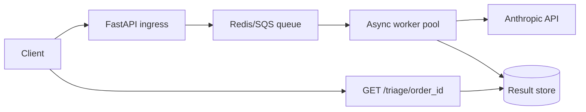

# FlockSRE Scaling Design

How to scale FlockSRE to triage **500 concurrent distressed orders** when the LLM has **p99 latency of 8 seconds**.

## Current bottleneck

The synchronous `POST /triage` handler blocks until Anthropic returns. At p99 = 8s, a single worker can complete at most ~7.5 triages/minute. Five hundred concurrent requests would queue indefinitely and time out.

## Target architecture

### 1. Async job queue

- `POST /triage` enqueues a job and returns `202 Accepted` with `{ "job_id": "...", "status": "pending" }`.
- Workers pull jobs from Redis Streams or SQS, call Anthropic, persist results.
- `GET /triage/{order_id}` or `GET /jobs/{job_id}` returns the report when ready.

### 2. Worker pool sizing

At p99 = 8s, one worker sustains ~0.125 req/s. For 500 concurrent orders with a 60s SLA:

- Required throughput: 500 / 60 ≈ **8.3 triages/s**
- Workers needed: 8.3 × 8 ≈ **67 workers** (round up for headroom → ~80)

Horizontally scale worker pods; keep API ingress stateless.

### 3. Concurrency limits and circuit breaker

- Per-worker concurrency cap (e.g. 5 in-flight Anthropic calls) to avoid memory spikes.
- Global rate limiter aligned with Anthropic tier limits.
- Circuit breaker: if p99 > 12s or error rate > 5%, pause dequeue and return `503` with retry-after on ingress.

### 4. Idempotency

- Key jobs by `order_id` + signal hash (or monotonic `incident_id`).
- Duplicate POST for the same key returns existing `job_id` instead of re-enqueueing.
- Prevents double-billing and conflicting triage reports during retries.

### 5. Signal freshness

- Attach TTL to queued jobs; drop or downgrade stale signals (>5 min old) before LLM call.
- Reduces wasted tokens on orders already resolved.

### 6. Observability

- OpenTelemetry trace per job: enqueue → worker pickup → Anthropic call → persist.
- Metrics: queue depth, wait time, Anthropic latency histogram, tool-validation retry rate.
- Alert when queue depth > 100 or p99 wait > 30s.

### 7. Cost and caching

- Cache triage reports for identical signal sets within a short window (e.g. 2 min) per restaurant outage pattern.
- Use Haiku for re-triage of low-severity repeats; Sonnet for first pass on critical incidents.

## Summary

| Concern | Change |
|---------|--------|
| 500 concurrent orders | Queue + ~80 async workers |
| p99 8s LLM latency | Non-blocking ingress; size pool to SLA |
| Reliability | Idempotency, circuit breaker, stale-signal TTL |
| Ops visibility | Traces + queue-depth metrics |
